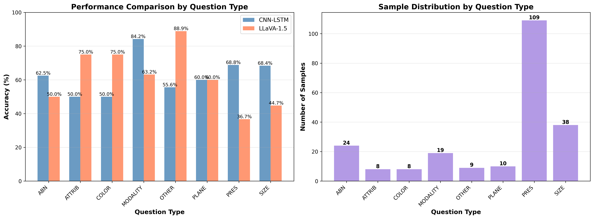
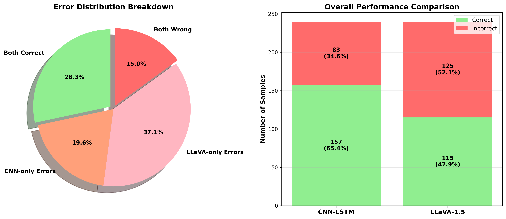
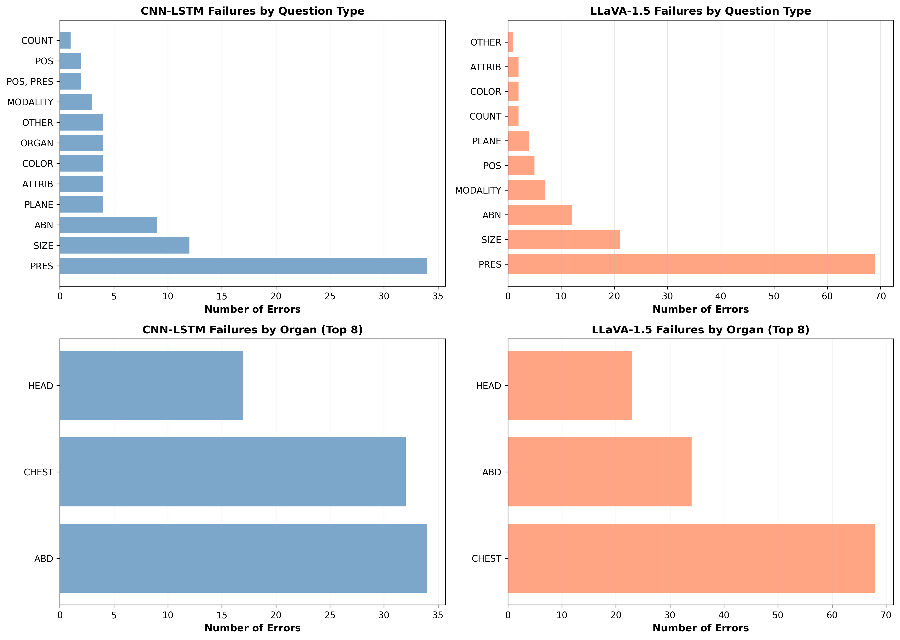

# Comparative Study of CNN-LSTM and LLaVA-1.5 for Medical Visual Question Answering

[](https://www.python.org/downloads/)
[](https://pytorch.org/)
[](https://opensource.org/licenses/MIT)

> A comprehensive comparative evaluation of task-specific CNN-LSTM and general-purpose vision-language models (LLaVA-1.5) on medical visual question answering using the VQA-RAD dataset.

## 📖 Overview

This project investigates the performance gap between domain-specific and general-purpose models in medical imaging tasks. Our findings demonstrate that:

- **CNN-LSTM (task-specific)**: 58.33% accuracy (140/240)
- **LLaVA-1.5 (zero-shot)**: 47.92% accuracy (115/240)

The 10.41 percentage points performance gap highlights the importance of domain adaptation for medical VQA tasks.

## 🎯 Key Findings

1. **Domain Gap**: General-purpose VLMs struggle with medical terminology despite strong general vision-language understanding
2. **Complementary Strengths**:
   - CNN-LSTM excels at spatial reasoning (ORGAN, POSITION)
   - LLaVA-1.5 better at semantic reasoning (MODALITY, ATTRIBUTE)
3. **Error Patterns**:
   - CNN-LSTM: Overfitting to common patterns
   - LLaVA-1.5: Medical terminology confusion

## 📊 Results

### Overall Performance

| Model | Accuracy | Precision | Recall | F1-Score |
|-------|----------|-----------|--------|----------|
| CNN-LSTM | 58.33% | 0.665 | 0.583 | 0.662 |
| LLaVA-1.5 | 47.92% | 0.542 | 0.479 | 0.508 |

### Performance by Question Type



### Error Distribution



### Failure Pattern Analysis



## 🚀 Installation

### Prerequisites

- Python 3.8+
- CUDA 11.8+ (for GPU support)
- 16GB+ RAM recommended
- 10GB+ GPU memory for LLaVA inference

### Setup

```bash
# Clone the repository
git clone https://github.com/Chooling98/med-vqa-comparative-study.git
cd med-vqa-comparative-study

# Create virtual environment
python -m venv venv
source venv/bin/activate  # On Windows: venv\Scripts\activate

# Install dependencies
pip install -r requirements.txt
```

## 📥 Dataset

This project uses the **VQA-RAD** dataset:

- **Source**: [OSF Repository](https://osf.io/89kps/)
- **Size**: 315 radiological images, 2,248 QA pairs
- **Split**: 1,810 training / 438 testing

### Download Instructions

1. Download from [https://osf.io/89kps/](https://osf.io/89kps/)
2. Extract to `data/` folder:
   ```
   data/
   ├── VQA_RAD Dataset Public.json
   └── VQA_RAD Image Folder/
   ```

## 🏗️ Model Architecture

### CNN-LSTM Configuration

```python
# Image Encoder
- Base Model: ResNet-50 (pretrained on ImageNet)
- Output Dimension: 2048
- Frozen: Yes (transfer learning)

# Question Encoder
- Embedding Dimension: 100
- LSTM Hidden Dimension: 256
- Vocabulary Size: 786 tokens

# Multimodal Fusion
- Concatenation: [2048-dim image + 256-dim question] = 2304-dim
- Classifier: Linear(2304 → 2) for binary classification
- Total Trainable Parameters: ~14M
```

### Training Configuration

```python
- Optimizer: Adam (lr=0.001)
- Loss Function: CrossEntropyLoss
- Batch Size: 16
- Epochs: 5
- Training Time: ~2 minutes (GPU)
```

### LLaVA-1.5 Configuration

```python
- Vision Encoder: CLIP ViT-L/14 (224×224 input)
- Language Model: Vicuna-7B (fine-tuned LLaMA)
- Total Parameters: ~7 Billion
- Evaluation Mode: Zero-shot (no fine-tuning on VQA-RAD)
```

## 🔬 Usage

### Run Full Experiment

Open and run the Jupyter notebook:

```bash
jupyter notebook notebooks/sanity_check.ipynb
```

The notebook contains 18 sections covering:
- Data loading and preprocessing
- CNN-LSTM training and evaluation
- LLaVA-1.5 zero-shot evaluation
- Comprehensive analysis and visualization

### Individual Model Inference

#### CNN-LSTM

```python
from src.model import CNNLSTM
from src.dataset import VQARADDataset

# Load model
model = CNNLSTM(vocab_size=..., embed_dim=100, hidden_dim=256, num_answers=2)

# Inference
# See notebooks/sanity_check.ipynb Section 8-10
```

#### LLaVA-1.5

```python
from src.llava_infer import load_llava_model, run_llava_inference

# Load model
model, processor = load_llava_model()

# Inference
# See notebooks/sanity_check.ipynb Section 11-12
```

## 📂 Project Structure

```
src/                    # Source code
├── model.py           # CNN-LSTM architecture
├── llava_infer.py     # LLaVA inference utilities
├── dataset.py         # VQA-RAD dataset class
├── yn_dataset.py      # Yes/No subset dataset
└── split.py           # Data splitting functions

notebooks/             # Jupyter notebooks
└── sanity_check.ipynb # Main experiment (18 sections)

results/               # Experimental results
├── figures/           # Visualizations
└── tables/            # Performance tables

docs/                  # Documentation
├── FINAL_REPORT.pdf   # Complete technical report
└── *.md               # Analysis documents
```

## 📊 Experiment Sections

The main notebook (`sanity_check.ipynb`) contains 18 comprehensive sections:

1. **Section 0**: Import libraries
2. **Section 1**: Load VQA-RAD dataset
3. **Section 2**: Split dataset by QID
4. **Section 3**: Build CNN vocabularies
5. **Section 4**: Create CNN datasets
6. **Section 5**: Initialize CNN-LSTM model
7. **Section 6**: Define training function
8. **Section 7**: Train CNN-LSTM model
9. **Section 8**: Evaluate CNN-LSTM on Yes/No questions
10. **Section 9**: Display CNN-LSTM results
11. **Section 10**: LLaVA model loading
12. **Section 11**: LLaVA Yes/No evaluation
13. **Section 12**: Display LLaVA results
14. **Section 13**: Side-by-side comparison
15. **Section 14**: Open-ended question evaluation
16. **Section 15**: Comprehensive analysis
17. **Section 16**: Comprehensive results with visualization
18. **Section 17**: Open-ended question analysis

## 🔍 Key Insights

### Why CNN-LSTM Outperforms LLaVA-1.5?

1. **Domain Adaptation**: CNN-LSTM trained on VQA-RAD, LLaVA-1.5 zero-shot
2. **Medical Terminology**: LLaVA struggles with specialized medical terms
3. **Task Specificity**: Yes/No classification benefits from focused training
4. **Visual Grounding**: Medical images differ from natural images in LLaVA's pretraining

See [docs/WHY_LLAVA_LOWER_ACCURACY.md](docs/WHY_LLAVA_LOWER_ACCURACY.md) for detailed analysis.

## 📈 Reproducibility

All experiments are fully reproducible:

- Fixed random seeds (`torch.manual_seed(42)`)
- Deterministic data splits (by `qid_linked_id`)
- Complete hyperparameters documented
- Model checkpoints available upon request

## 🤝 Contributing

This is an academic project. For questions or collaboration:

- Open an issue
- Contact: [Your Email]

## 📄 Citation

If you use this code or findings in your research:

```bibtex
@misc{yourname2025medvqa,
  title={Comparative Study of CNN-LSTM and LLaVA-1.5 for Medical VQA},
  author={Your Name},
  year={2025},
  howpublished={\url{https://github.com/YOUR_USERNAME/med-vqa-comparative-study}}
}
```

## 📚 References

1. Lau, J. J., Gayen, S., Ben Abacha, A., & Demner-Fushman, D. (2018). A dataset of clinically generated visual questions and answers about radiology images. *Scientific Data*, 5, 180251.

2. Li, C., Wong, C., Zhang, S., et al. (2023). LLaVA-Med: Training a large language-and-vision assistant for biomedicine in one day. *arXiv preprint arXiv:2306.00890*.

3. Liu, H., Li, C., Wu, Q., & Lee, Y. J. (2023). Visual instruction tuning. *arXiv preprint arXiv:2304.08485*.

## 📝 License

This project is licensed under the MIT License - see the [LICENSE](LICENSE) file for details.

## 🙏 Acknowledgments

- VQA-RAD dataset creators
- Hugging Face for LLaVA-1.5 model hosting
- PyTorch and torchvision teams

---

**WOA7015 Advanced Machine Learning - Alternative Assignment**
**University of Malaya**
**2025**
